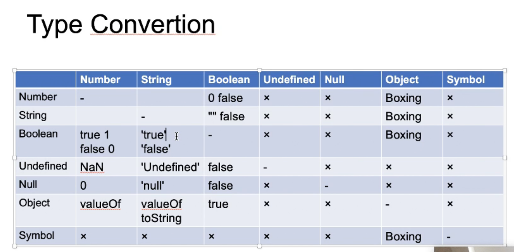

# 第三周总结
## 重学前端之Javascript-Statement
* Atom
* Expression
* Statement
* Structure
* Program/Module
## Atom
#### &emsp; Grammar      
      Expression(表达式)
        •Member
            a.b
            a[b]
            foo`string` 
            super.b
            super[b]
            new.target 
            new Foo()
        •New
            new Foo
            new a()
            new new a()
        •Call
            foo()
            super()
            foo()[b]
            foo().b
            foo()`string`
        •Left Handside & Right Handside
            a.b = c;
            a+b = c;
        •Update
            a++
            a--
            --a
            ++a
        •Unary
            delete a.b
            void 0; // 生成undefined
            typeof a
            +a
            -a
            ~a
            !a // !!a 转换为boolean值
            await a
        •Exponental
            **
#### &emsp; Runtime

# 类型转换

数据类型

### 装箱操作： 把基本数据类型转换为对应的引用类型的操作
    基础类型 => 包装类型 Boolean String Boolean Number
### 拆箱操作： 把引用类型转换为基本数据类型的操作
    通常通过引用类型的valueOf()和toString()方法来实现。或者内部调用了抽象操作 ToPrimitive。

# 4月25
## Atom
### &emsp; Grammar
        简单语句
            • ExpressionStatement
            • EmptyStatement
            • DebuggerStatement
            • ThrowStatement
            • ContinueStatement
            • BreakStatement
            • ReturnStatement
        组合语句
        声明
            • FunctionDeclaration
            • GeneratorDeclaration
            • AsyncFunctionDeclaration
            • AsyncGeneratorDeclaration
            • VariableStatement
            • ClassDeclaration
            • LexicalDeclaration
            • function
            • function * 
            • async function
            • async function
            • var
            • class
            • const
            • let
### &emsp; Runtime
        Completion Record
             • [[type]]: normal, break, continue, return, or throw
             • [[value]]: Types
             • [[target]]: label
        Lexical Environment
### &emsp; block
        • BlockStatement
            • [[type]]: normal
            • [[value]]: --
            • [[target]]: --
### &emsp; Iteration
    • while( ▒▒ ) ░░░░
    • do ░░░░ while( ▒▒ );
    • for( ▓▓ ; ▒▒ ; ▒▒) ░░░░
    • for( ▓▓ in ▒▒ ) ░░░░
    • for( ▓▓ of ▒▒ ) ░░░░
    • for await( of )
    • var
    • const / let
    • in
### &emsp; 标签、循环、break、continue
    • LabelledStatement
    • IterationStatement
    • ContinueStatement
    • BreakStatement
    • SwitchStatement
    • [[type]]: break continue
    • [[value]]: --
    • [[target]]: label
### &emsp; try
    try {
    ░░░░░░░░
    } catch( ▓▓▓ ) {
    ░░░░░░░░
    } finally {
    ░░░░░░░░
    } 
    • [[type]]: return
    • [[value]]: --
    • [[target]]: label
### &emsp; 预处理（pre-process）
### &emsp; 作用域
## JS 标准里面有哪些对象是我们无法实现的，都有哪些特性

Function Object
* [[call]] 视为函数Function
* [[Construct]] 可以被new 操作符调用，根据new的规则返回对象
Array Object
* Property == length 设置对象的length属性，根据length的变化对对象进行操作
* newLength > length 用空扩充数组
* ewLength < length 截取数组

String Object
* string的length是不可写不可配的。

Arguments Object
* [[callee]] 视为函数参数对对象，伪数组 caller

Object
* [[Get]] property被访问时调用 get

* [[Set]] property被赋值时调用 set

* [[GetPrototypeOf]] 对应getPrototypeOf方法 获取对象原型

* [[SetPrototypeOf]] 对应setPrototypeOf方法 设置对象原型

* [[GetOwnProperty]] getOwnPropertyDescriptor 获取对象私有属性的描述列表

* [[HasProperty]] hasOwnProperty 私有属性判断

* [[IsExtensible]] isExtensible对象是否可扩展

* [[PreventExtensions]] preventExtension控制对象是否可以添加属性

* [[DefineOwnProperty]] defineProperty 定义对象属性

* [[Delete]] delete 操作符

* [[OwnPropertyKeys]] Object.keys() Object.entries() Object.values()

* [[Call]] 能够调用call

Module Namespece
* [[Module]] 视为一个引入的模块 [[Exports]] 视为一个导出的模块